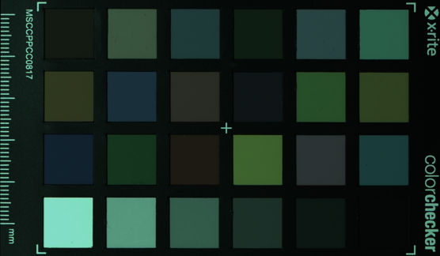
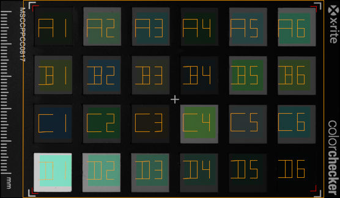

# Basic workflow for making a DNG profile using a color checker and DcamProf
* Download DcamProf from https://www.ludd.ltu.se/~torger/dcamprof.html and Argyll CMS from https://www.argyllcms.com/downloadwin.html
* Get a physical test target. The classic Macbeth/X-Rite 24 patch color checker is a fine choice.

* Get calibrated light source. For single illuminant profile D50 is recommended, for dual illuminant profile StandardA and D65 are recommended. If you don't have calibrated light source shoot your target  outside in real daylight or use LED lamp with temperature 5000K for a rough alternative of D50 light

* Get a reference file for the test target, preferably containing reflectance spectra. If you're using that 24 patch color checker, look for cc24_ref.cie in the DCamProf distribution. Note that X-Rite changed their formula slightly in ColorCheckers produced November 2014 and later. The bundled cc24_ref.cie is for targets produced before November 2014, and cc24_ref-new.cie is for targets produced November 2014 and later.

* Shoot your test target under the desired light source. Avoid over- or under-exposure. Store in PGM format.

* Convert the raw file to a 16-bit linear TIFF without white balancing. To do that, first convert it to 16-bit PPM with fast_debayer application, then use ImageMagick convert utility or image editor like GIMP or Photoshop, that support 16-bit images.

* Crop so only the target is visible, and rotate if needed. Argyll is very sensitive to target orientation. If you use some image editor to do this make sure that the full 16-bit range is kept, that is don't use 8-bit GIMP for example. If you use RawTherapee, you can crop and rotate in there. Final image should look like that:


* Use Argyll scanin command to generate a .ti3 file. It needs the target reference file, test target layout file and raw image as 16-bit TIFF as input.<br>
`scanin -v -p -dipn rawfile.tif ColorChecker.cht cc24_ref.cie`<br>
Passport version: <br>
`scanin -v -p -dipn rawfile.tif ColorCheckerPassport.cht cc24_ref.cie`<br>
The scanin command will generate a diag.tif which shows patch matching. Look at it to see that it matched. If everything is good, diag file will look like this:
 <br>
rawfile.ti3 file will contain the raw values read from rawfile.tif together with reference data from the cc24_ref.cie file.

* Use DCamProf to make a profile from Argyll’s rawfile.ti3 target file.<br>
`dcamprof make-profile -g cc24-layout.json rawfile.ti3 profile.json`<br>
The above command doesn’t specify any illuminants, which means that the profile will be made for D50 and the rawfile.ti3 must contain reflectance spectra (it will if the example cc24_ref.cie is used) or have it’s XYZ values related to D50. To change calibration illuminant, use the -i parameter, and if the .ti3 lacks reflectance spectra, specify its XYZ illuminant using -I.

DCamProf will automatically relax the LUT a bit, that is prioritize smoothness over accuracy. How this is done can be precisely manually controlled if you desire, see the documentation for the make-profile command for an in-depth explanation.

The target layout is provided in a JSON file cc24-layout.json. If the target contains both black and white patches, glare will be modeled and reduced, and if the target contains several white patches (not the CC24, but for example a ColorChecker SG) it will be flat-field corrected.

* Convert the native format profile to a DNG profile (DCP).<br>
`dcamprof make-dcp -n "Camera manufacturer and model" -d "My Profile" profile.json profile.dcp`<br>
For many raw converters the camera manufacturer and model must exactly match what the raw converter is expecting. For example if using Adobe Lightroom the name must match the name which Lightroom is using for it’s own DCPs.
The description tag (set by -d, “My Profile” in this example) will be the one shown in the profile select box, as we can see at Adobe Lightroom.

* The DNG profile is now ready to use in pgm2dng.

The following cmd script will create single illuminant profile. It assumes that ArgyllCMS is installed at c:\Argyll and DcamProf is installed at c:\DcamProf, fast_debayer and ImageMagick convert utility are in PATH. PGM file D50.pgm with pattern RGGB is in the current folder.

```bash
set CAMERA_NAME=MC031CG-SY-TC
set MANUFACTURER=Ximea
set ARGILL_PATH=c:\Argyll
set DCAM_PROF_PATH=c:\DcamProf

fast_debayer.exe -i D50.pgm -o D50.ppm -type DFPD -pattern RGGB
convert -depth 16 D50.ppm D50.tif
%ARGILL_PATH%\bin\scanin -v -p -dipn D50.tif %ARGILL_PATH%\ref\ColorChecker.cht %DCAM_PROF_PATH%\data-examples\cc24_ref.cie diag_D50.tif
%DCAM_PROF_PATH%\dcamprof make-profile  -i D50 -g %DCAM_PROF_PATH%\ data-examples\cc24-layout.json D50.ti3 D50.json
%DCAM_PROF_PATH%\dcamprof make-dcp -n "%MANUFACTURER% %CAMERA_NAME%" -d "X-rite-D50" -h 24,12,12 -t acr -o neutral D50.json %MANUFACTURER%-%CAMERA_NAME%-D50.dcp
```
